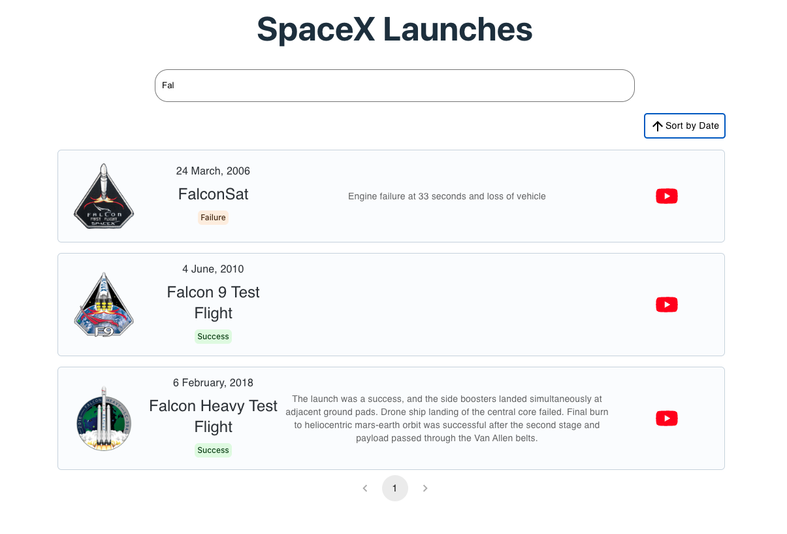

# Space Mission Portal

An application that allows users to browse SpaceX launches and learn more about them.

- Website: https://space-mission-portal.onrender.com/
- CI/CD Pipeline: https://github.com/guodap/space-mission-portal/actions



## Set Up

1. Clone the [guodap/space-mission-portal](https://github.com/guodap/space-mission-portal) repository

   ```sh
   git clone https://github.com/guodap/space-mission-portal
   ```

2. Install dependencies and run the app

   ```sh
   npm i && npm start
   ```

3. Open the app at the url displayed in the terminal (default: http://localhost:5173)

## Build app for Production

```sh
npm run build
```

## Features and Design Decisions

### Display Launches

- **Card Layout**: Each launch is displayed in a responsive card format.
  - **Reasoning**: Cards are a visually appealing and organized way to display information, making it easy for users to browse and read details about each launch.
  - **Card vs Table Layout**: Cards offer a visually appealing layout for browsing, while tables might be better for displaying detailed, structured data. Timestamp has been changed to date for better readability. The content has an image, long description, and link, which seemed best suited for a card. Cards also suit the responsive design.
  - **Future**:
    - Clearly label all information e.g. Name, Status for better usability.
    - Extend the application to show more data beyond launches from other available endpoints
  - **Bug**: The date is being rounded up by one day because of the local UTC format. Need to raise a GH issue and fix this.

### Sorting

- **Sorting by Date (showing most recent launches by default)**:

  - **Reasoning**: Launch data is historical so sorted by date, instead of name. Users are generally interested in the most recent data, so by default, showing the most recent data makes the application more relevant and useful.

### Search Functionality

- **Searching for launches by name on user input**:

  - **Reasoning**: Instant feedback from searching enhances the user experience by giving real-time feedback and quickly narrowing down the list of launches. If an API call had to be made, a button click would be used instead.
  - **Future Improvementse**:
    - Advanced search features to allow users to filter by more attributes such as launch status or date range.
    - Debounce/delay to avoid re-rendering.
    - Filtering Options: Filter launches by status, date, and other criteria to enhance user experience.

### Client-Side Pagination

- **Pagination by breacrumb**:

  - **Reasoning**: Chose button pagination as it gives users more control navigating the data. Scroll pagination could also be a good option here as we're displaying cards, especially on mobile. With client-side pagination, only content that can be rendered is displayed, increasing performance.
  - **Future**: Utilize server-side pagination for better performance. Client-side pagination improves performance by rendering only visible data, while server-side pagination is ideal for handling large datasets without overloading the client. Aim to display about 10-20 items per page to balance meaningful content with performance.

## UX Considerations

- **Error Message**: An error message is displayed if the API fails to fetch data.
  - Future: Make this page way cooler for better UX while we annoy the user with an error.
- **No Results Message**: A message is displayed if no data is returned from the API (but the request is successful) or no search results match user search input.
  - Future: Also improve this basic component.
- **Loading Indication**: A loading message is displayed if the API data is being fetched.
  - **Future**: Show a skeleton for better perceived performance and better UX so the user can anticipate the content they will see.
- **Responsive Design**: The application is responsive, allowing users to browse the app on any device, e.g. mobile or desktop.

## Security Considerations

- **Vulnerability Scan**: A CI/CD process has been set up with a vulnerability check, running `npm run audit` and recording the result.

  - **Future**: Use a more sophisticated tool and trigger automatic PRs with potential fixes. We can also set up alerts.

## Future Improvements for Performance and UX

- **Caching**: Implement caching o reduce network calls as launch data is very predictable and doesn't change often.
- **Accessibility**: Ensure the application is accessible to all users e.g. more descriptive labels added for reading assistants
- **User Consideration**: Identify the target users and tailor data presentation and functionality choises to their needs. For this, we should understand the user and perform thorough design/UX reviews. We could also conduct beta testimg with users and gather feedback.

## Testing

- **Tests Performed**
  - Exploratory Testing: Exploratory testing has been conducted to cover scenarios (happy paths and error cases).
  - Utility Function Unit Testing.
- **Future**
  - Component and Hooks Testing: Add testing for components and hooks! I didn't have enough time to debug configurations needed.

## Technologies

- **React**: A JavaScript library for building user interfaces.
- **Axios**: A promise-based HTTP client for making API requests.
- **Material-UI**: A popular React UI framework for implementing design components.
- **SpaceX API** (3rd party): A 3rd party API. The data source providing detailed information about space launches.
- **React** - A JavaScript library for building user interfaces
- **Vite** - A build tool for modern web projects suitable for small applications

## Acknowledgements

- SpaceX - The company that makes the rockets
- [r-spacex/SpaceX-API](https://github.com/r-spacex/SpaceX-API) - The unofficial API for SpaceX data
